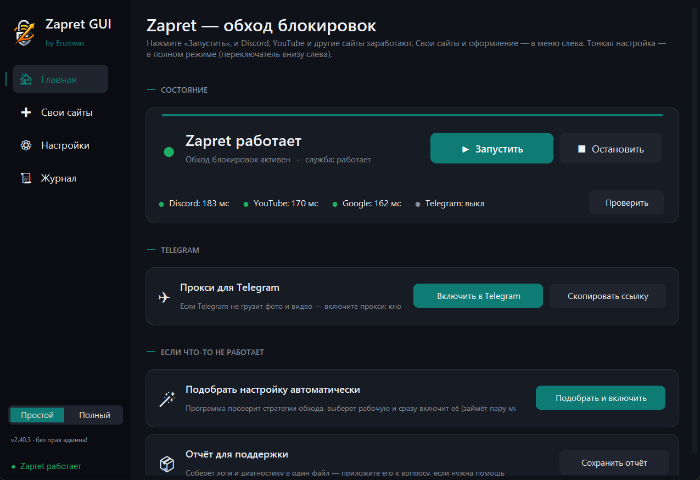

<div align="center">

# Zapret GUI

Современное Windows-приложение для **обхода блокировок Discord, YouTube и Telegram**.
Удобная надстройка над DPI-движком `winws.exe` + WinDivert из проекта
[zapret](https://github.com/Flowseal/zapret-discord-youtube) — со встроенным
Telegram-прокси, умным авто-подбором стратегии, авто-восстановлением и диагностикой.

[](https://github.com/Enzowax/Zapret-GUI/releases/latest)
[](https://github.com/Enzowax/Zapret-GUI/actions)
[](https://github.com/Enzowax/Zapret-GUI/releases)


> ⚙️ **Это не VPN.** Локальный обход DPI: приложение правит исходящие сетевые
> пакеты так, чтобы цензор не мог опознать и заблокировать соединение. Трафик
> идёт напрямую, без посредников, серверов и подписок.

</div>



| Полный режим · тёмная тема | Полный режим · светлая тема |
|:---:|:---:|
|  |  |

---

## 🚀 Быстрый старт

1. Скачайте **`ZapretControl.zip`** из [последнего релиза](https://github.com/Enzowax/Zapret-GUI/releases/latest).
2. Распакуйте папку `ZapretControl` куда удобно и запустите **`ZapretControl.exe`**.
3. При первом запуске мастер спросит режим. Выберите **«Простой»** и согласитесь
   на автоматическую настройку — программа сама подберёт рабочую стратегию и
   включит обход. Готово.

Всё необходимое (winws, WinDivert, списки доменов, пресеты, Telegram-прокси) уже
внутри архива. Права администратора запрашиваются автоматически — они нужны
драйверу WinDivert.

> ⚠️ Windows Defender / SmartScreen может ругаться (как и на сам zapret) — это
> ложное срабатывание, см. раздел [Антивирус](#-антивирус--smartscreen).

## 🧭 Два режима интерфейса

Переключатель **«Простой | Полный»** всегда внизу слева — можно менять в любой момент.

- **Простой** — четыре понятных пункта меню, ничего лишнего:
  - **Главная** — большие кнопки **Запустить / Остановить**, живое «здоровье»
    Discord / YouTube / Google, Telegram в один клик, **«Подобрать и включить»**
    (сама найдёт рабочую стратегию и запустит) и отчёт для поддержки;
  - **Свои сайты** — домены для обхода + переключатель **«Не трогать Steam / Dota 2»**;
  - **Настройки** — тема, **выбор акцентного цвета**, автозапуск с Windows, обновления, антивирус;
  - **Журнал**.

  Поставил, нажал — работает.
- **Полный** — всё для тонкой настройки: пресеты, служба Windows, свои сайты,
  DoH, авто-поиск, диагностика, журнал, автообновления. Ничего не урезано —
  просто скрыто от новичков.

## ✨ Возможности

**Обход и запуск**
- **Дашборд на главной** — статус обхода (с именем активной стратегии), живое
  «здоровье» (Discord / YouTube / Google + индикатор Telegram-прокси) и кнопки
  Старт/Стоп одной плиткой; проверка доступности сайтов по TLS с задержками.
- **Пресеты** — стратегии обхода хранятся декларативно в `presets.json` (~20
  вариантов desync); выбор из списка, просмотр итоговых аргументов winws.
- **Служба Windows** — установка обхода как службы автозапуска при включении ПК,
  удаление, автосинхронизация выбранного пресета со службой.
- **Игровой фильтр** — расширяет диапазон портов (Выкл / TCP+UDP / TCP / UDP) для
  игр, которым нужен обход не только на 80/443.
- **Автозапуск обхода** при старте приложения (тумблер).

**Умный подбор и восстановление**
- **Авто-поиск стратегии** в две фазы: быстрый отсев по приоритету (последняя
  рабочая → запасной пул → похожие по типу десинка → остальные), затем точная
  проверка кандидатов с таблицей результатов по сервисам. Быстрый режим с ранней
  остановкой. Проверка идёт **с верификацией TLS-сертификата и имени хоста** —
  поэтому заглушка цензора не может ложно засчитаться как рабочая стратегия.
- **Применить и запустить / Установить как службу** — лучшая стратегия
  применяется к работающему обходу или ставится службой в один клик.
- **Авто-восстановление (watchdog)** — при потере связи переключает стратегию из
  запасного пула, а если пул исчерпан — сам запускает авто-поиск и применяет
  найденную (по желанию).

**Telegram**
- **Встроенный MTProto-WS-прокси** — отдельный exe не нужен, всё работает внутри
  приложения: запуск/остановка, ссылка `tg://`, «Скопировать», «Открыть в
  Telegram» (сам поднимет прокси и откроет ссылку).
- **Настройки прокси** — свой порт, смена MTProto-секрета, тумблер запасного
  Cloudflare-прокси, статистика соединений и трафика, открытие лога прокси.

**Свои сайты и списки**
- **Свои домены для обхода** — добавьте любые сайты (например, `rutracker.org`);
  можно вставлять целые ссылки — лишнее уберётся, `www.` и дубли отбросятся,
  кириллические домены переводятся в punycode.
- **«Не трогать Steam / Dota 2»** — исключает трафик Steam/Valve из десинка, если
  при обходе не грузятся гайды/сборки/гильдия.
- **Обновление списков и IPSet** из upstream (Flowseal) — вручную или по
  расписанию (раз в неделю), чтобы обход не устаревал.

**Диагностика и совместимость**
- **Диагностика окружения со светофором** и **кнопками авто-починки**: права
  администратора, Base Filtering Engine, файлы и драйвер WinDivert, TCP
  timestamps, конфликтующие службы/программы обхода (GoodbyeDPI и др.), сетевые
  «оптимизаторы» (Killer/SmartByte/cFos), порт Telegram-прокси, статус DoH,
  доступность Discord/YouTube.
- **Отчёт для поддержки** — один клик собирает логи и диагностику в zip.

**Безопасность и удобство**
- **Шифрованный DNS (DoH)** — переводит системный DNS активных адаптеров на
  Cloudflare или Google с DoH (часть блокировок делается по DNS); при выключении
  восстанавливает прежний DNS.
- **Полный автозапуск при входе в систему** — приложение, обход и Telegram-прокси
  стартуют сами (задача планировщика с правами админа без UAC-окна); задача
  **самочинится**, если путь к exe изменился после обновления/переноса.
- **Оформление** — тёмная / светлая / системная тема и **выбор акцентного цвета**
  на лету, без перезапуска.
- **Журнал** с фильтром по тексту, копированием и очисткой; копирование/вставка в
  полях работает при любой раскладке клавиатуры.
- **Трей** — сворачивание при закрытии (обход продолжает работать), запуск/остановка
  обхода и выход из меню значка; уведомления о событиях.
- **Экспорт/импорт настроек** одним файлом.

**Обновления и надёжность**
- **Самообновление** через GitHub Releases с проверкой размера архива.
- **Контроль целостности** встроенных бинарников по SHA-256, автодосыл свежих
  апстрим-списков при обновлении версии.
- **Защита от повторного запуска** (single instance), логирование необработанных
  исключений в `logs/crash.log`.

## 🔧 Как это работает

Цензор использует **DPI** (Deep Packet Inspection) — анализирует пакеты и блокирует
соединение, если узнаёт «запрещённый» сайт (например, по имени в TLS-рукопожатии).

`winws.exe` через драйвер **WinDivert** перехватывает исходящие пакеты и применяет
**десинхронизацию** (split/fake/disorder и т.п.): рассыпает или маскирует первый
пакет так, что DPI не успевает опознать соединение, а сервер собирает его обратно.
Набор приёмов — это **стратегия** (пресет); под разных провайдеров работают разные,
поэтому есть авто-поиск.

**Telegram** работает иначе — через встроенный локальный **MTProto-прокси**: Telegram
ходит на `127.0.0.1`, а прокси доставляет трафик до серверов Telegram.

## 🛡 Антивирус / SmartScreen

Приложение распаковывает и запускает `winws.exe` + драйвер WinDivert (он лезет в
сетевой стек), поэтому антивирусы иногда дают **ложное срабатывание**. Без платной
подписи кода это не убрать полностью, но на своём ПК — легко:

- **В приложении:** «Настройки» → **«Добавить в исключения»** (Defender) — добавит
  папку приложения в исключения Windows Defender (нужны права администратора).
- **SmartScreen** при первом запуске: «Подробнее» → «Выполнить в любом случае».
- **Вручную:** «Безопасность Windows» → «Защита от вирусов и угроз» → «Параметры
  защиты» → «Исключения» → добавить папку с приложением.

Исходники открыты — можно собрать `exe` самому (см. [Разработка](#-разработка)).

## ❓ Частые вопросы и решение проблем

<details>
<summary><b>Перестало пробивать после смены провайдера / обновления блокировок</b></summary>

DPI у провайдеров меняется. В **простом режиме** нажмите **«Подобрать и включить»**,
в **полном** — откройте «Авто-поиск» и подберите стратегию заново. Приложение
проверит пресеты по приоритету и применит лучшую. Заодно включите в «Настройках»
автообновление списков и IPSet.
</details>

<details>
<summary><b>Авто-поиск показал стратегию рабочей, но сайт всё равно не грузится</b></summary>

Раньше проверка засчитывала любое завершённое TLS-рукопожатие, поэтому соединение,
которое цензор заворачивал на свою заглушку, ложно считалось рабочим — да ещё и с
минимальной задержкой попадало в «лучшие». Теперь проверка **верифицирует
сертификат и имя хоста**: заглушка не проходит, в списке остаются только
по-настоящему рабочие стратегии. Если обновились со старой версии — прогоните
авто-поиск ещё раз. В журнале фаза 1 (быстрый отсев) и фаза 2 (точная проверка,
как в таблице) подписаны отдельно.
</details>

<details>
<summary><b>Обход не запускается / winws.exe падает</b></summary>

Зайдите в **«Диагностику»** — она покажет причину (нет прав администратора,
выключен Base Filtering Engine, конфликт с другим обходом вроде GoodbyeDPI,
сетевые «оптимизаторы» Killer/SmartByte) и предложит авто-починку. Помогают также
«Сбросить WinDivert» и «Остановить конфликты».
</details>

<details>
<summary><b>В Dota 2 не грузятся гайды / сборки / гильдия (при включённом обходе)</b></summary>

Контент гайдов/гильдии Steam отдаёт через те же сети (Cloudflare/Akamai/Valve),
по которым работает обход, поэтому winws задевает эти соединения. Включите
**«Свои сайты» → «Не трогать Steam / Dota 2»** — обход перестанет десинкать
трафик Steam/Valve (по SNI), и контент загрузится. Касается и других игр Steam.
</details>

<details>
<summary><b>В Telegram иногда мигает «Подключение»</b></summary>

Это фоновые соединения к CDN-датацентрам Telegram через публичный Cloudflare-пул
(он часто отвечает 429). На реальные сообщения это не влияет. Можно выключить
тумблер **«Запасной Cloudflare-прокси»** на странице Telegram.
</details>

<details>
<summary><b>Автозапуск с Windows «включён», но приложение не стартует</b></summary>

Обычно причина — задача автозапуска осталась со старым путём после переноса папки
или обновления. Приложение **само чинит это при запуске**: проверяет, что задача
указывает на текущий `.exe`, и молча перерегистрирует её. Достаточно один раз
запустить приложение вручную. Если не помогло — выключите и снова включите тумблер
**«Запускаться вместе с Windows»** в настройках.
</details>

<details>
<summary><b>Не копируется/вставляется в поля при русской раскладке</b></summary>

Исправлено. Ctrl+C/V/X/A теперь ловятся по позиции клавиши, а не по символу,
поэтому работают при любой раскладке — в «Своих сайтах», фильтре журнала и полях
Telegram-прокси.
</details>

<details>
<summary><b>Как перенести настройки на другой ПК</b></summary>

«Управление» → «Инструменты» → **«Экспорт настроек»** сохранит конфиг и пресеты в
один JSON; на другом ПК — **«Импорт настроек»**. После импорта перезапустите
приложение.
</details>

## 🧑‍💻 Разработка

Запуск из исходников:
```bat
pip install customtkinter pystray pillow darkdetect cryptography
python zapret_app.pyw
```

Тесты и линт (гейт в CI — без их прохождения релиз не собирается):
```bat
pip install pytest ruff
pytest tests/ -q
ruff check --select=E9,F63,F7,F82 .
```

Сборка `exe` (PyInstaller, формат onedir):
```bat
pip install pyinstaller
pyinstaller --noconfirm --distpath dist --workpath build ZapretControl.spec
```

**Релиз** автоматизирован: поднять `APP_VERSION` в `zapret_core.py`, запушить тег
`vX.Y.Z` — GitHub Actions прогоняет тесты+линт и при успехе собирает и публикует
релиз с `ZapretControl.zip`. Приложение само предложит обновиться.

> Формат **onedir** (exe + папка `_internal`) выбран намеренно: нет распаковки во
> временную папку при каждом запуске — быстрее старт и нет ошибок загрузки Python
> DLL при самообновлении.

## 📁 Структура

| Путь | Назначение |
|------|------------|
| `zapret_app.pyw` | интерфейс (CustomTkinter): страницы, режимы, темы, фоновые задачи |
| `zapret_core.py` | логика: пути, пресеты, процессы/служба, авто-поиск, обновления, диагностика, DoH, прокси, автозапуск |
| `tgproxy/` | встроенный MTProto-WS-прокси (вендорный пакет, MIT) |
| `presets.json` | декларативные пресеты (стратегии как данные) |
| `bin/`, `lists/` | движок winws/WinDivert и списки доменов/IP (из проекта zapret) |
| `tests/` | юнит-тесты чистых функций ядра (гейт CI) |
| `ZapretControl.spec` · `.github/workflows/build.yml` | сборка и CI |

## 📜 Лицензии и благодарности

- Движок `winws` / WinDivert и стратегии — проект zapret (bol-van) и сборка
  [Flowseal/zapret-discord-youtube](https://github.com/Flowseal/zapret-discord-youtube).
- Встроенный Telegram-прокси — пакет `tgproxy/` из открытого проекта
  [Flowseal/tg-ws-proxy](https://github.com/Flowseal/tg-ws-proxy) (MIT, см.
  `tgproxy/LICENSE`); используется только ядро прокси, без отдельного exe.

Это самостоятельный GUI by **Enzowax**; он не связан и не использует код платных
сборок.
