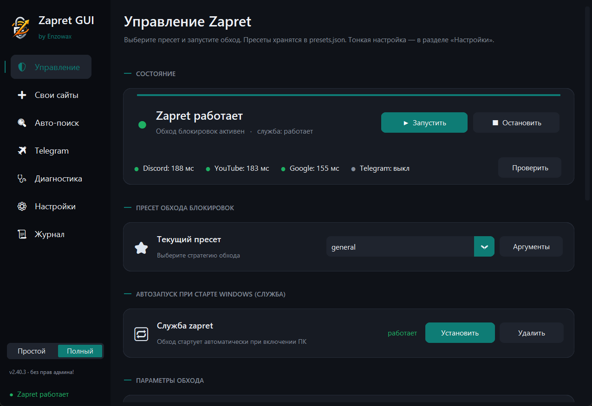
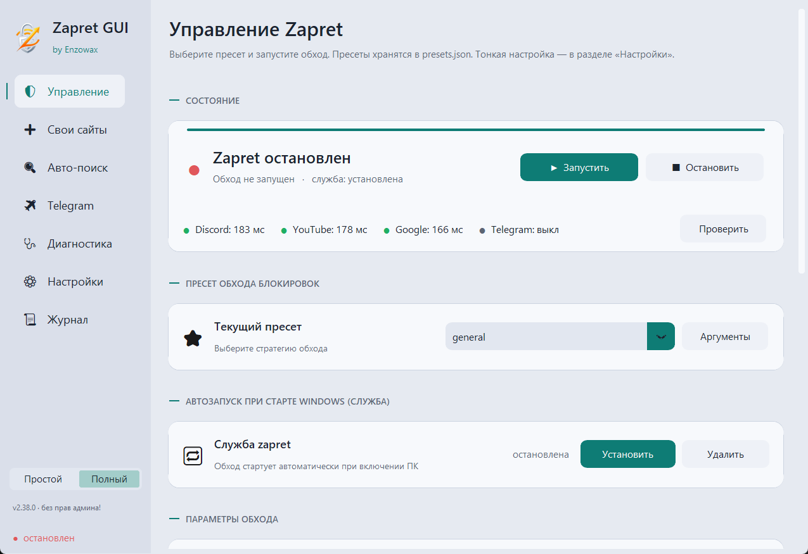

<div align="center">

# Zapret GUI

Современное Windows-приложение для **обхода блокировок Discord, YouTube и Telegram**.
Удобная надстройка над DPI-движком `winws.exe` + WinDivert из проекта
[zapret](https://github.com/Flowseal/zapret-discord-youtube) — со встроенным
Telegram-прокси, умным авто-подбором стратегии и диагностикой.

[](https://github.com/Enzowax/Zapret-GUI/releases/latest)
[](https://github.com/Enzowax/Zapret-GUI/actions)
[](https://github.com/Enzowax/Zapret-GUI/releases)


> ⚙️ **Это не VPN.** Локальный обход DPI: приложение правит исходящие сетевые
> пакеты так, чтобы цензор не мог опознать и заблокировать соединение. Трафик
> идёт напрямую, без посредников и подписок.

</div>

| Тёмная тема | Светлая тема |
|:---:|:---:|
|  |  |

---

## 🚀 Быстрый старт

1. Скачайте **`ZapretControl.zip`** из [последнего релиза](https://github.com/Enzowax/Zapret-GUI/releases/latest).
2. Распакуйте папку `ZapretControl` куда удобно и запустите **`ZapretControl.exe`**.
3. Нажмите **«Запустить»** — обход активен. По желанию: «Авто-поиск» подберёт
   лучшую стратегию под вашего провайдера, а кнопка службы включит автозапуск.

Всё необходимое (winws, WinDivert, списки, пресеты, Telegram-прокси) уже внутри.
Права администратора запрашиваются автоматически — они нужны драйверу WinDivert.

> ⚠️ Windows Defender / SmartScreen может ругаться (как и на сам zapret) — это
> ложное срабатывание, см. раздел [Антивирус](#-антивирус--smartscreen).

## ✨ Возможности

- **Дашборд на главной** — статус обхода, живое «здоровье» (Discord / YouTube /
  Google + Telegram-прокси с задержками) и кнопки Старт/Стоп одной плиткой.
- **Умный авто-поиск** стратегии: пресеты пробуются по приоритету (последний
  рабочий → запасной пул → похожие по типу десинка), быстрый режим с ранней
  остановкой, асинхронные проверки хостов.
- **Авто-восстановление** (watchdog): при деградации связи переключает стратегию
  из запасного пула, а если пул исчерпан — сам запускает авто-поиск.
- **Свои сайты** — добавьте любые домены для обхода (пишутся в
  `list-general-user.txt`, поддомены учитываются).
- **Автообновление** списков и IP-набора (`ipset-all`) из upstream по расписанию —
  обход не устаревает сам по себе.
- **Диагностика** окружения со светофором и **кнопками авто-починки**: права,
  Base Filtering Engine, драйвер WinDivert, конфликты с другими обходами и сетевым
  ПО, порты, DNS, доступность сайтов.
- **Telegram-прокси** — встроенный MTProto-WS-прокси (отдельный exe не нужен):
  запуск/остановка, ссылка `tg://`, статистика соединений и трафика, лог,
  тумблер Cloudflare-фолбэка.
- **Автозапуск** — служба Windows для обхода и полный автозапуск (приложение +
  обход + прокси при входе в систему, со сворачиванием в трей).
- **Шифрованный DNS (DoH)**, исключения Windows Defender, журнал с фильтром и
  копированием, **тёмная/светлая тема** «Signal» с выбором акцента на лету.
- **Самообновление** через GitHub Releases; пресеты как данные (`presets.json`),
  контроль целостности бинарников по SHA-256.

## 🔧 Как это работает

Цензор использует **DPI** (Deep Packet Inspection) — анализирует пакеты и блокирует
соединение, если узнаёт «запрещённый» сайт (например, по имени в TLS-рукопожатии).

`winws.exe` через драйвер **WinDivert** перехватывает исходящие пакеты и применяет
**десинхронизацию** (split/fake/disorder и т.п.): рассыпает или маскирует первый
пакет так, что DPI не успевает опознать соединение, а сервер собирает его обратно.
Набор приёмов — это **стратегия** (пресет); под разных провайдеров работают разные,
поэтому есть авто-поиск.

**Telegram** работает иначе — через встроенный локальный **MTProto-прокси**: Telegram
ходит на `127.0.0.1`, а прокси доставляет трафик до серверов Telegram.

## 🛡 Антивирус / SmartScreen

Приложение распаковывает и запускает `winws.exe` + драйвер WinDivert (он лезет в
сетевой стек), поэтому антивирусы иногда дают **ложное срабатывание**. Без платной
подписи кода это не убрать полностью, но на своём ПК — легко:

- **В приложении:** «Настройки» → **«Добавить в исключения»** (Defender) — добавит
  папку приложения в исключения Windows Defender (нужны права администратора).
- **SmartScreen** при первом запуске: «Подробнее» → «Выполнить в любом случае».
- **Вручную:** «Безопасность Windows» → «Защита от вирусов и угроз» → «Параметры
  защиты» → «Исключения» → добавить папку с приложением.

Исходники открыты — можно собрать `exe` самому (см. [Разработка](#-разработка)).

## ❓ Решение проблем

<details>
<summary><b>Перестало пробивать после смены провайдера / обновления блокировок</b></summary>

DPI у провайдеров меняется. Откройте **«Авто-поиск»** и подберите рабочую стратегию
заново — приложение проверит пресеты по приоритету и применит лучшую. Заодно
включите в «Настройках» автообновление списков.
</details>

<details>
<summary><b>Обход не запускается / winws.exe падает</b></summary>

Зайдите в **«Диагностику»** — она покажет причину (нет прав администратора,
выключен Base Filtering Engine, конфликт с другим обходом вроде GoodbyeDPI,
сетевые «оптимизаторы» Killer/SmartByte) и предложит авто-починку.
</details>

<details>
<summary><b>В Dota 2 не грузятся гайды / сборки / гильдия (при включённом обходе)</b></summary>

Контент гайдов/гильдии Steam отдаёт через те же сети (Cloudflare/Akamai/Valve),
по которым работает обход, поэтому winws задевает эти соединения. Включите
**«Свои сайты» → «Не трогать Steam / Dota 2»** — обход перестанет десинкать
трафик Steam/Valve (по SNI), и контент загрузится. Касается и других игр Steam.
</details>

<details>
<summary><b>В Telegram иногда мигает «Подключение»</b></summary>

Это фоновые соединения к CDN-датацентрам Telegram через публичный Cloudflare-пул
(он часто отвечает 429). На реальные сообщения это не влияет. Можно выключить
тумблер **«Запасной Cloudflare-прокси»** на странице Telegram.
</details>

<details>
<summary><b>Xbox / Microsoft Store не работают</b></summary>

Это блокировка на уровне гео/IP со стороны сервисов, а не DPI — обход тут не
поможет, нужен VPN. Не баг приложения.
</details>

## 🧑‍💻 Разработка

Запуск из исходников:
```bat
pip install customtkinter pystray pillow darkdetect cryptography
python zapret_app.pyw
```

Тесты и линт (гейт в CI — без их прохождения релиз не собирается):
```bat
pip install pytest ruff
pytest tests/ -q
ruff check --select=E9,F63,F7,F82 .
```

Сборка `exe` (PyInstaller, формат onedir):
```bat
pip install pyinstaller
pyinstaller --noconfirm --distpath dist --workpath build ZapretControl.spec
```

**Релиз** автоматизирован: поднять `APP_VERSION` в `zapret_core.py`, запушить тег
`vX.Y.Z` — GitHub Actions прогоняет тесты+линт и при успехе собирает и публикует
релиз с `ZapretControl.zip`. Приложение само предложит обновиться.

> Формат **onedir** (exe + папка `_internal`) выбран намеренно: нет распаковки во
> временную папку при каждом запуске — быстрее старт и нет ошибок загрузки Python
> DLL при самообновлении.

## 📁 Структура

| Путь | Назначение |
|------|------------|
| `zapret_app.pyw` | интерфейс (CustomTkinter): страницы, темы, фоновые задачи |
| `zapret_core.py` | логика: пути, пресеты, процессы/служба, обновления, диагностика, DoH, прокси |
| `tgproxy/` | встроенный MTProto-WS-прокси (вендорный пакет, MIT) |
| `presets.json` | декларативные пресеты (стратегии как данные) |
| `bin/`, `lists/` | движок winws/WinDivert и списки (из проекта zapret) |
| `tests/` | юнит-тесты чистых функций ядра |
| `ZapretControl.spec` · `.github/workflows/build.yml` | сборка и CI |

## 📜 Лицензии и благодарности

- Движок `winws` / WinDivert и стратегии — проект zapret (bol-van) и сборка
  [Flowseal/zapret-discord-youtube](https://github.com/Flowseal/zapret-discord-youtube).
- Встроенный Telegram-прокси — пакет `tgproxy/` из открытого проекта
  [Flowseal/tg-ws-proxy](https://github.com/Flowseal/tg-ws-proxy) (MIT, см.
  `tgproxy/LICENSE`); используется только ядро прокси, без отдельного exe.

Это самостоятельный GUI by **Enzowax**; он не связан и не использует код платных
сборок.
